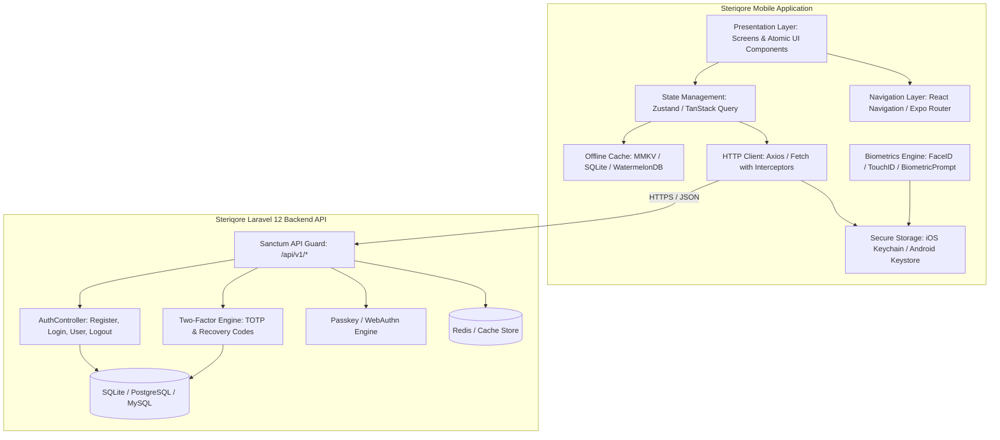
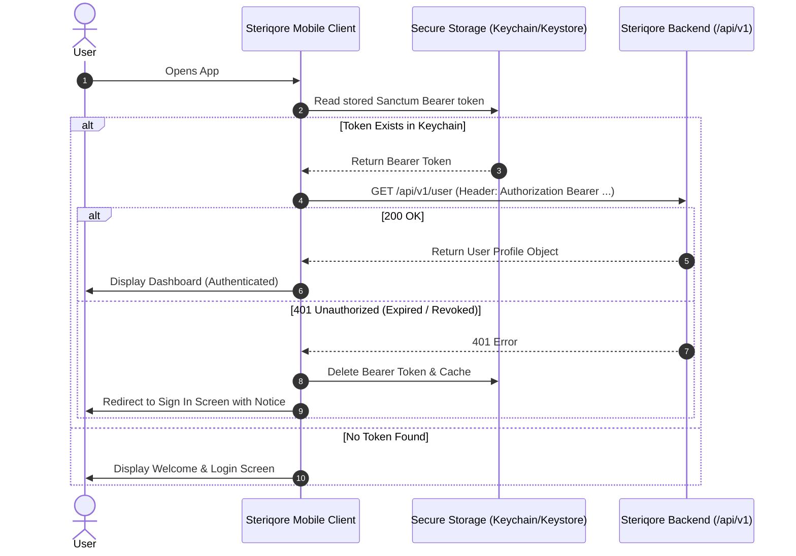

# Steriqore Mobile App: Complete System Design & UI/UX Architecture Specification

**Document Version:** 1.1.0  
**Target Backend:** Steriqore API v1 (Laravel 12 / PHP 8.5 / Laravel Sanctum / Fortify)  
**Supported Platforms:** iOS 16+ & Android 12+ (Universal Mobile Architecture)  
**Framework Recommendations:** React Native (Expo) with TypeScript / Flutter / Native Swift & Kotlin  

---

## 1. Executive Summary & Product Vision

### 1.1 Product Purpose
Steriqore Mobile is a companion mobile application designed to deliver an intuitive, high-performance, and secure experience for Steriqore users on iOS and Android devices. It connects with the Steriqore Laravel backend via RESTful Sanctum APIs (`/api/v1/*`), offering real-time data access, biometric authentication (FaceID/Fingerprint/Passkeys), multi-factor security management, and seamless offline-first capability.

### 1.2 Core Architectural Principles
1. **Zero-Friction UX:** Sub-100ms perceived latency using optimistic UI updates, skeleton placeholders, and predictive data fetching.
2. **Bank-Grade Security:** Biometric hardware encryption (iOS Keychain / Android Keystore), Laravel Sanctum Bearer token rotation, TOTP 2FA, and device-level session auditing.
3. **Unified Design Language:** Built upon Steriqore's minimal, modern aesthetic—utilizing modern typography (Instrument Sans / SF Pro), balanced OKLCH-mapped color palettes, dark/light dynamic theme switching, and tactile haptic feedback.
4. **Resilient Connectivity:** Offline caching with optimistic synchronization and graceful degradation during network disruptions.

---

## 2. End-to-End System Architecture

### 2.1 High-Level Architecture Diagram



### 2.2 Client-Side Layer Breakdown

| Layer | Responsibility | Key Technologies & Patterns |
| :--- | :--- | :--- |
| **Presentation Layer** | Renders mobile screens, atomic components, modals, and gestures | React Native / React 19 / StyleSheet / NativeWind |
| **Navigation Layer** | Handles stack transitions, persistent bottom tabs, and deep linking | React Navigation 7 / Expo Router (file-based routing) |
| **State & Cache Layer** | Manages server-state sync, client UI state, and optimistic cache | TanStack Query v5 (React Query) + Zustand |
| **Security Layer** | Encrypted key storage for Sanctum Bearer tokens and biometrics | `expo-secure-store` / `react-native-keychain` + `expo-local-authentication` |
| **Network Layer** | HTTP calls, auto-bearer injection, 401 refresh/logout interceptor | Axios with typed request/response contracts matching `routes/api.php` |
| **Persistence Layer** | High-speed local cache for offline viewing and preferences | MMKV (fastest mobile key-value storage) |

### 2.3 Backend API Integration Matrix

Steriqore Mobile communicates directly with the registered Laravel API endpoints:

```
Base URL: https://steriqore.example.com/api/v1
```

| HTTP Method | Route Endpoint | Authentication | Description / Payload | Client Handling |
| :--- | :--- | :--- | :--- | :--- |
| `GET` | `/` | Public | Healthcheck & API capability handshake | Initial app launch network verification |
| `POST` | `/register` | Public | `{ name, email, password, device_name }` | Stores Bearer token securely; redirects to Dashboard |
| `POST` | `/login` | Public | `{ email, password, device_name }` | Handles 2FA challenge response or stores token |
| `GET` | `/user` | `Bearer Token` | Retrieves authenticated user profile & roles | Hydrates user profile state on app wake-up |
| `POST` | `/logout` | `Bearer Token` | Revokes current Sanctum personal access token | Clears local cache & Keychain; resets to Welcome |
| `GET` | `/settings/security` | `Bearer Token` | Fetches 2FA status and Passkey credentials | Populates Security Management view |

---

## 3. Brand Identity, Logo Assets & Complete Icon System

### 3.1 The Steriqore Official Logo Mark

Steriqore's brand icon is a geometric 3D isometric polygon structure representing structural precision, data cubes, and security.

#### A. Master SVG Source Code (`viewBox="0 0 40 42"`)
```xml
<svg viewBox="0 0 40 42" fill="none" xmlns="http://www.w3.org/2000/svg">
    <path
        fill-rule="evenodd"
        clip-rule="evenodd"
        d="M17.2 5.63325L8.6 0.855469L0 5.63325V32.1434L16.2 41.1434L32.4 32.1434V23.699L40 19.4767V9.85547L31.4 5.07769L22.8 9.85547V18.2999L17.2 21.411V5.63325ZM38 18.2999L32.4 21.411V15.2545L38 12.1434V18.2999ZM36.9409 10.4439L31.4 13.5221L25.8591 10.4439L31.4 7.36561L36.9409 10.4439ZM24.8 18.2999V12.1434L30.4 15.2545V21.411L24.8 18.2999ZM23.8 20.0323L29.3409 23.1105L16.2 30.411L10.6591 27.3328L23.8 20.0323ZM7.6 27.9212L15.2 32.1434V38.2999L2 30.9666V7.92116L7.6 11.0323V27.9212ZM8.6 9.29991L3.05913 6.22165L8.6 3.14339L14.1409 6.22165L8.6 9.29991ZM30.4 24.8101L17.2 32.1434V38.2999L30.4 30.9666V24.8101ZM9.6 11.0323L15.2 7.92117V22.5221L9.6 25.6333V11.0323Z"
        fill="currentColor"
    />
</svg>
```

#### B. High-Resolution App Icon Vector (`viewBox="0 0 166 166"`)
Used for App Store, Google Play Store, and Splash branding (`public/favicon.svg`):
```xml
<svg width="166" height="166" viewBox="0 0 166 166" fill="none" xmlns="http://www.w3.org/2000/svg">
    <path 
        fill-rule="evenodd" 
        clip-rule="evenodd" 
        d="M162.041 38.7592C162.099 38.9767 162.129 39.201 162.13 39.4264V74.4524C162.13 74.9019 162.011 75.3435 161.786 75.7325C161.561 76.1216 161.237 76.4442 160.847 76.6678L131.462 93.5935V127.141C131.462 128.054 130.977 128.897 130.186 129.357L68.8474 164.683C68.707 164.763 68.5538 164.814 68.4007 164.868C68.3432 164.887 68.289 164.922 68.2284 164.938C67.7996 165.051 67.3489 165.051 66.9201 164.938C66.8499 164.919 66.7861 164.881 66.7191 164.855C66.5787 164.804 66.4319 164.76 66.2979 164.683L4.97219 129.357C4.58261 129.133 4.2589 128.81 4.0337 128.421C3.8085 128.032 3.68976 127.591 3.68945 127.141L3.68945 22.0634C3.68945 21.8336 3.72136 21.6101 3.7788 21.393C3.79794 21.3196 3.84262 21.2526 3.86814 21.1791C3.91601 21.0451 3.96068 20.9078 4.03088 20.7833C4.07874 20.7003 4.14894 20.6333 4.20638 20.5566C4.27977 20.4545 4.34678 20.3491 4.43293 20.2598C4.50632 20.1863 4.60205 20.1321 4.68501 20.0682C4.77755 19.9916 4.86051 19.9086 4.96581 19.848L35.6334 2.18492C36.0217 1.96139 36.4618 1.84375 36.9098 1.84375C37.3578 1.84375 37.7979 1.96139 38.1862 2.18492L68.8506 19.848H68.857C68.9591 19.9118 69.0452 19.9916 69.1378 20.065C69.2207 20.1289 69.3133 20.1863 69.3867 20.2566C69.476 20.3491 69.5398 20.4545 69.6164 20.5566C69.6707 20.6333 69.7441 20.7003 69.7887 20.7833C69.8621 20.911 69.9036 21.0451 69.9546 21.1791C69.9802 21.2526 70.0248 21.3196 70.044 21.3962C70.1027 21.6138 70.1328 21.8381 70.1333 22.0634V87.6941L95.686 72.9743V39.4232C95.686 39.1997 95.7179 38.9731 95.7753 38.7592C95.7977 38.6826 95.8391 38.6155 95.8647 38.5421C95.9157 38.408 95.9604 38.2708 96.0306 38.1463C96.0785 38.0633 96.1487 37.9962 96.2029 37.9196C96.2795 37.8175 96.3433 37.7121 96.4326 37.6227C96.506 37.5493 96.5986 37.495 96.6815 37.4312C96.7773 37.3546 96.8602 37.2716 96.9623 37.2109L127.633 19.5479C128.021 19.324 128.461 19.2062 128.91 19.2062C129.358 19.2062 129.798 19.324 130.186 19.5479L160.85 37.2109C160.959 37.2748 161.042 37.3546 161.137 37.428C161.217 37.4918 161.31 37.5493 161.383 37.6195C161.473 37.7121 161.536 37.8175 161.613 37.9196C161.67 37.9962 161.741 38.0633 161.785 38.1463C161.859 38.2708 161.9 38.408 161.951 38.5421C161.98 38.6155 162.021 38.6826 162.041 38.7592ZM157.018 72.9743V43.8477L146.287 50.028L131.462 58.5675V87.6941L157.021 72.9743H157.018ZM126.354 125.663V96.5176L111.771 104.85L70.1301 128.626V158.046L126.354 125.663ZM8.80126 26.4848V125.663L65.0183 158.043V128.629L35.6494 112L35.6398 111.994L35.6271 111.988C35.5281 111.93 35.4452 111.847 35.3526 111.777C35.2729 111.713 35.1803 111.662 35.1101 111.592L35.1038 111.582C35.0208 111.502 34.9634 111.403 34.8932 111.314C34.8293 111.228 34.7528 111.154 34.7017 111.065L34.6985 111.055C34.6411 110.96 34.606 110.845 34.5645 110.736C34.523 110.64 34.4688 110.551 34.4432 110.449C34.4113 110.328 34.4049 110.197 34.3922 110.072C34.3794 109.976 34.3539 109.881 34.3539 109.785V109.778V41.2045L19.5322 32.6619L8.80126 26.4848ZM36.913 7.35007L11.3635 22.0634L36.9066 36.7768L62.4529 22.0602L36.9066 7.35007H36.913ZM50.1999 99.1736L65.0215 90.6374V26.4848L54.2906 32.6651L39.4657 41.2045V105.357L50.1999 99.1736ZM128.91 24.713L103.363 39.4264L128.91 54.1397L154.453 39.4232L128.91 24.713ZM126.354 58.5675L111.529 50.028L100.798 43.8477V72.9743L115.619 81.5106L126.354 87.6941V58.5675ZM67.5711 124.205L105.042 102.803L123.772 92.109L98.2451 77.4053L68.8538 94.3341L42.0663 109.762L67.5711 124.205Z" 
        fill="#FF2D20"
    />
</svg>
```

#### C. React Native Native Component (`src/components/atoms/AppLogoIcon.tsx`)
```tsx
import React from 'react';
import Svg, { Path, SvgProps } from 'react-native-svg';

interface AppLogoIconProps extends SvgProps {
    size?: number;
    color?: string;
}

export const AppLogoIcon: React.FC<AppLogoIconProps> = ({
    size = 32,
    color = '#1B1B18',
    ...props
}) => (
    <Svg width={size} height={(size * 42) / 40} viewBox="0 0 40 42" fill="none" {...props}>
        <Path
            fillRule="evenodd"
            clipRule="evenodd"
            d="M17.2 5.63325L8.6 0.855469L0 5.63325V32.1434L16.2 41.1434L32.4 32.1434V23.699L40 19.4767V9.85547L31.4 5.07769L22.8 9.85547V18.2999L17.2 21.411V5.63325ZM38 18.2999L32.4 21.411V15.2545L38 12.1434V18.2999ZM36.9409 10.4439L31.4 13.5221L25.8591 10.4439L31.4 7.36561L36.9409 10.4439ZM24.8 18.2999V12.1434L30.4 15.2545V21.411L24.8 18.2999ZM23.8 20.0323L29.3409 23.1105L16.2 30.411L10.6591 27.3328L23.8 20.0323ZM7.6 27.9212L15.2 32.1434V38.2999L2 30.9666V7.92116L7.6 11.0323V27.9212ZM8.6 9.29991L3.05913 6.22165L8.6 3.14339L14.1409 6.22165L8.6 9.29991ZM30.4 24.8101L17.2 32.1434V38.2999L30.4 30.9666V24.8101ZM9.6 11.0323L15.2 7.92117V22.5221L9.6 25.6333V11.0323Z"
            fill={color}
        />
    </Svg>
);
```

---

### 3.2 Mobile Icon System Catalog (Lucide Adaptation)

Steriqore Mobile uses the clean, geometric **Lucide Mobile Iconography** set (24x24 grid, 2px stroke weight, rounded caps/joins) to match the web interface.

| Icon Name | Category | Screen / Component | Description & Visual Intent |
| :--- | :--- | :--- | :--- |
| `LayoutGrid` | Navigation | Tab 1: Dashboard | 4-quadrant grid symbol representing main dashboard overview |
| `Activity` | Navigation | Tab 2: Activity / Audit | Pulse graph waveform representing real-time system logs |
| `ShieldCheck` | Navigation | Tab 3: Security Hub | Protected shield with checkmark for Fortify 2FA & Passkeys |
| `User` | Navigation | Tab 4: Profile & Settings | Minimal user silhouette for account management |
| `KeyRound` / `Key` | Security | Passkey Credentials | Hardware passkey authenticator item |
| `Fingerprint` | Security | Biometric Quick-Unlock | Biometric sensor / Touch ID prompt button |
| `ScanFace` | Security | FaceID Unlock | Apple Face ID / facial recognition visual prompt |
| `Lock` / `Unlock` | Auth | Password inputs | Closed padlock for encrypted fields |
| `Eye` / `EyeOff` | Forms | Password Reveal | Toggles plain-text password visibility |
| `Bell` | Notifications| Header Top Right | Alert bell with unread badge dot indicator |
| `Search` | Search / Filter| Feed Search Bar | Magnifying lens with clean inline clear button |
| `RefreshCw` | Sync | Dashboard Pull-to-Refresh| Rotating arrows for API state re-synchronization |
| `QrCode` | Security | 2FA TOTP Setup Modal | QR symbol for scanning authenticator secret keys |
| `Smartphone` | Devices | Active Sanctum Sessions | Mobile device indicator in active token list |
| `Laptop` | Devices | Active Sanctum Sessions | Desktop / Browser device indicator |
| `LogOut` | Auth | Profile Footer | Arrow exiting doorway for Sanctum token revocation |
| `Trash2` | Actions | Passkey Delete / Account | Destructive red trash icon |
| `Sun` / `Moon` | Theme | Appearance Settings | Light / Dark mode toggle buttons |
| `ChevronRight` | Navigation | List Item Cards | Subtle navigation indicator pointing to sub-screens |
| `ArrowLeft` | Navigation | Header Back Button | Standard native back arrow (iOS / Android) |
| `CheckCircle2` | Feedback | Success Toasts | Green confirmation badge |
| `AlertTriangle` | Feedback | Warning Alerts | Amber caution indicator for 2FA disable alerts |
| `XCircle` | Feedback | Validation Errors | Red error circle for invalid form fields |
| `Copy` | Utilities | Recovery Codes Sheet | One-tap clipboard copy button |

---

### 3.3 App Store & Native App Launcher Icon Specs

```
steriqore-mobile/assets/
├── icon.png                 # 1024 x 1024 px master App Icon (No transparency for iOS)
├── adaptive-icon.png        # 1024 x 1024 px Android Foreground Layer (Logo centered within 66% safe zone)
├── adaptive-background.png  # #1B1B18 (Dark) or #FFFFFF (Light) Android Background Layer
├── favicon.png              # 48 x 48 px Web preview icon
└── splash.png               # 2048 x 2048 px Splash screen asset with centered Steriqore logo
```

---

## 4. UI/UX Design System & Visual Tokens

The mobile design system directly adapts Steriqore's web styling (`resources/css/app.css`) for native touch surfaces.

### 4.1 Color Palette & Theme Tokens

```
===================================================================================
TOKEN                   LIGHT MODE (HEX / OKLCH)       DARK MODE (HEX / OKLCH)
===================================================================================
--background            #FFFFFF (oklch 1 0 0)          #161615 (oklch 0.145 0 0)
--surface / --card      #FFFFFF (oklch 1 0 0)          #1E1E1C (oklch 0.205 0 0)
--foreground (Text)     #1B1B18 (oklch 0.145 0 0)      #EDEDEC (oklch 0.985 0 0)
--foreground-muted      #706F6C (oklch 0.556 0 0)      #A1A09A (oklch 0.708 0 0)
--primary               #1B1B18 (oklch 0.205 0 0)      #F5F5F3 (oklch 0.985 0 0)
--primary-foreground    #FFFFFF (oklch 0.985 0 0)      #1B1B18 (oklch 0.205 0 0)
--border / --input      #E5E5E3 (oklch 0.922 0 0)      #2E2E2B (oklch 0.269 0 0)
--accent / --highlight  #F4F4F2 (oklch 0.970 0 0)      #2A2A28 (oklch 0.269 0 0)
--brand-accent          #F53003 (Laravel/Steriqore Red)#FF4433 (Bright Red)
--destructive           #DC2626 (oklch 0.577 0.245)    #EF4444 (oklch 0.637 0.237)
--success               #16A34A (Forest Green)         #22C55E (Emerald Green)
--warning               #D97706 (Amber)                #F59E0B (Bright Amber)
===================================================================================
```

### 4.2 Typography Scale (Mobile-Optimized)
Primary Font: **Instrument Sans** (with fallback to SF Pro on iOS and Roboto on Android).

| Style | Font Size | Line Height | Weight | Letter Spacing | Purpose |
| :--- | :--- | :--- | :--- | :--- | :--- |
| **Large Title** | `32pt` | `38pt` | Bold (700) | `-0.4px` | Main screen titles (Dashboard, Welcome) |
| **Title 1** | `24pt` | `30pt` | SemiBold (600) | `-0.3px` | Section headers, modal headers |
| **Title 2** | `20pt` | `26pt` | SemiBold (600) | `-0.2px` | Card headers, subsection titles |
| **Headline** | `17pt` | `22pt` | SemiBold (600) | `-0.1px` | List item titles, prominent buttons |
| **Body (Regular)** | `15pt` | `20pt` | Regular (400) | `0.0px` | Paragraph text, inputs, form values |
| **Body (Medium)** | `15pt` | `20pt` | Medium (500) | `0.0px` | Emphasized body text, tab labels |
| **Callout** | `13pt` | `18pt` | Regular (400) | `+0.1px` | Secondary metadata, input labels |
| **Caption 1** | `12pt` | `16pt` | Regular (400) | `+0.2px` | Timestamps, badge labels, footers |
| **Caption 2** | `10pt` | `13pt` | Medium (500) | `+0.3px` | Micro-badges, helper hints |

### 4.3 Elevation, Borders & Corner Radii

* **Corner Radii:**
  * `radius-sm`: `6pt` (Badges, small tags, tooltips)
  * `radius-md`: `10pt` (Input fields, primary buttons, list items)
  * `radius-lg`: `16pt` (Cards, modal containers, bottom sheets)
  * `radius-full`: `9999pt` (Pills, avatar circles, biometric trigger buttons)
* **Shadow Tokens (iOS Shadow / Android Elevation):**
  * `elevation-subtle`: `0px 1px 3px rgba(0, 0, 0, 0.05)` (Cards, navigation bar)
  * `elevation-medium`: `0px 4px 12px rgba(0, 0, 0, 0.08)` (Dropdown menus, modals)
  * `elevation-high`: `0px 12px 32px rgba(0, 0, 0, 0.14)` (Bottom action sheets, alerts)
* **Safe Area Standard:**
  * Top Safe Area padding dynamic per notch / Dynamic Island.
  * Bottom Home Bar indicator offset: `34pt` on iOS, `16pt` on Android gesture navigation.

---

## 5. Mobile Component Architecture (Atomic Design)

```
src/
├── components/
│   ├── atoms/
│   │   ├── Button.tsx              # Primary, Outline, Ghost, Destructive, Loading
│   │   ├── Input.tsx               # Text, Email, Password (reveal toggle)
│   │   ├── OtpInput.tsx            # 6-digit auto-advancing verification boxes
│   │   ├── Avatar.tsx              # User image with initial fallbacks
│   │   ├── Badge.tsx               # Status indicator (Active, Verified, Pending)
│   │   ├── ToggleSwitch.tsx        # Haptic-enabled toggle switch
│   │   ├── Skeleton.tsx            # Pulsing placeholder shapes
│   │   └── AppLogoIcon.tsx         # Exact Steriqore isometric polygon SVG
│   ├── molecules/
│   │   ├── FormField.tsx           # Label + Input + Validation Error message
│   │   ├── NavigationHeader.tsx    # Title, Back button, Action icons
│   │   ├── MetricCard.tsx          # Stat value, delta change, sparkline icon
│   │   ├── ListItemCard.tsx        # Title, subtitle, chevron, left icon
│   │   ├── SearchBar.tsx           # Search input with clear button & debounce
│   │   ├── BiometricPromptBtn.tsx  # FaceID / Fingerprint one-tap CTA
│   │   └── ToastBanner.tsx         # Floating flash notification
│   ├── organisms/
│   │   ├── BottomTabBar.tsx        # Custom tab bar with active indicator & haptics
│   │   ├── ActionBottomSheet.tsx   # Gesture-driven bottom drawer modal
│   │   ├── TwoFactorModal.tsx      # TOTP setup QR code & recovery code view
│   │   ├── PasskeyManagerList.tsx  # List of registered hardware passkeys
│   │   └── EmptyStateView.tsx      # Illustration, title, subtitle & action CTA
│   └── templates/
│       ├── SafeScreenLayout.tsx    # Keyboard-avoiding safe area wrapper
│       ├── AuthLayout.tsx          # Branding header, card wrapper & footer links
│       └── DashboardLayout.tsx     # Collapsible header, sticky tabs & content
```

---

## 6. Screen-by-Screen UI/UX Specifications & Wireframes

### Phase 1: Authentication & Onboarding Flows

#### Screen 01: Splash & Biometric Quick-Unlock
* **UX Objective:** Rapidly resume authenticated sessions without asking for re-login.
* **Layout:**
  * Center: Steriqore minimal logo (smooth fade & scale entrance animation).
  * Auto-Detection: Checks local storage for active Sanctum Bearer token.
  * If token exists + Biometrics enabled: Automatically triggers iOS FaceID / Android BiometricPrompt.
  * If unauthenticated: Smooth cross-dissolve to Screen 02.

```
+------------------------------------------+
|                                          |
|                                          |
|                                          |
|                [ STERIQORE ]             |
|                                          |
|                    ( (o) )               |
|             "Touch ID or Face ID"        |
|                                          |
|                                          |
|          [ Unlock with Passcode ]        |
|                                          |
+------------------------------------------+
```

---

#### Screen 02: Welcome & Onboarding Screen
* **UX Objective:** Introduce value proposition and provide clean entry points to Login and Register.
* **Layout & Elements:**
  * Top Bar: Theme toggle (Light/Dark mode) & App Logo.
  * Hero Section: Crisp typography headline: *"Steriqore — Enterprise Clarity & Security"*.
  * Action Buttons:
    * Primary Button: `Get Started / Register` (Full width, dark background, rounded-lg).
    * Secondary Button: `Log In` (Full width, outline/ghost border).
  * Footer: Terms of Service and Privacy Policy links.

```
+------------------------------------------+
|  [Logo]                             [*]  |
|                                          |
|  STERIQORE                               |
|  Master your workflow with enterprise    |
|  precision and ironclad security.        |
|                                          |
|  [====================================]  |
|  |           Create Account           |  |
|  [====================================]  |
|                                          |
|  [------------------------------------]  |
|  |               Log In               |  |
|  [------------------------------------]  |
|                                          |
|    By continuing you accept our Terms    |
+------------------------------------------+
```

---

#### Screen 03: Sign In / Login Screen (`POST /api/v1/login`)
* **UX Objective:** Enable fast, secure authentication with device registration.
* **Form Inputs:**
  * `Email Input`: Autocomplete `email`, keyboard type `email-address`, clear button.
  * `Password Input`: Secure text entry with eye reveal toggle.
  * `Remember Me / Biometric Enable Switch`: Stores device token securely.
  * `Forgot Password?` Link: Routes to Password Reset flow.
  * `Device Name Auto-Injection`: Submits `Platform.constants.Model` (e.g. *"iPhone 15 Pro"*) to Laravel Sanctum.
* **Error Handling:** Inline field errors (e.g. *"These credentials do not match our records"*).

```
+------------------------------------------+
|  <- Back                                 |
|                                          |
|  Welcome back                            |
|  Sign in to your Steriqore account       |
|                                          |
|  Email Address                           |
|  [ user@example.com                    ] |
|                                          |
|  Password                                |
|  [ ************                    (o) ] |
|                                          |
|  [x] Save Device      Forgot password?   |
|                                          |
|  [====================================]  |
|  |               Sign In              |  |
|  [====================================]  |
|                                          |
|  ----------- or authenticate with -------|
|                                          |
|  [  [FaceID]  Sign In with Biometrics  ] |
|                                          |
|  Don't have an account? Sign up          |
+------------------------------------------+
```

---

#### Screen 04: Registration Screen (`POST /api/v1/register`)
* **UX Objective:** Frictionless account creation complying with Steriqore's password validation rules.
* **Form Inputs:**
  * `Full Name`: Autocomplete `name`.
  * `Email Address`: Unique check validation.
  * `Password`: Dynamic strength meter (Length >= 8, Mixed case, Numbers, Symbols).
  * `Confirm Password`: Live match validation indicator.
  * `Agree to Terms`: Interactive checkbox.
* **Success Action:** Dispatches `POST /api/v1/register`, securely persists Sanctum token, triggers haptic success feedback, redirects to Dashboard.

```
+------------------------------------------+
|  <- Back                                 |
|                                          |
|  Create an Account                       |
|  Start managing with Steriqore           |
|                                          |
|  Full Name                               |
|  [ Jane Doe                            ] |
|                                          |
|  Email Address                           |
|  [ jane@example.com                    ] |
|                                          |
|  Password                                |
|  [ ************                    (o) ] |
|  [==== Green Bar: Strong Password ===]   |
|                                          |
|  [x] I agree to Terms & Privacy          |
|                                          |
|  [====================================]  |
|  |           Create Account           |  |
|  [====================================]  |
+------------------------------------------+
```

---

#### Screen 05: Two-Factor Authentication (2FA) Challenge
* **UX Objective:** Secure 6-digit TOTP verification for protected user accounts.
* **Layout:**
  * Clean instructional header: *"Enter the 6-digit code from your authenticator app"*.
  * 6 separate auto-advancing digit boxes (smooth focus transitions, paste-clipboard support).
  * Number keypad automatically opened.
  * Secondary option: *"Use a Recovery Code"* bottom sheet toggle.

```
+------------------------------------------+
|  <- Back                                 |
|                                          |
|  Two-Factor Verification                 |
|  Enter the 6-digit code from your app.   |
|                                          |
|     +---+ +---+ +---+   +---+ +---+ +---+|
|     | 4 | | 8 | | 2 |   | 9 | | 1 | | 0 ||
|     +---+ +---+ +---+   +---+ +---+ +---+|
|                                          |
|  [====================================]  |
|  |              Verify Code           |  |
|  [====================================]  |
|                                          |
|        [ Use a Recovery Code ]           |
+------------------------------------------+
```

---

### Phase 2: Main Application & Bottom Tab Navigation

The authenticated core uses a 4-tab persistent navigation bar:

```
[ (1) Dashboard ]    [ (2) Activity ]    [ (3) Security ]    [ (4) Profile ]
```

---

#### Screen 06: Dashboard / Home Screen
* **UX Objective:** At-a-glance overview of system status, active metrics, quick actions, and recent operations.
* **Header:** User Avatar, *"Hello, {user.name}"*, Notifications bell with red badge dot.
* **Metrics Carousel / Grid:**
  * System Health: *Operational (99.99%)*
  * Active Sessions: *2 Devices*
  * Security Score: *98% (2FA Enabled)*
* **Quick Actions Row:**
  * `[ + New Request ]` `[ 🛡 Passkeys ]` `[ ⚙ Settings ]` `[ 🔄 Sync ]`
* **Recent Activity Feed:** Scrollable cards with status pills, timestamps, and detail view navigation.
* **Interactions:** Pull-to-refresh (`GET /api/v1/user` & sync).

```
+------------------------------------------+
|  [Avatar] Hello, Alex          [Bell(1)] |
|  Steriqore Cloud Environment             |
|------------------------------------------|
|  +------------------+ +----------------+ |
|  | System Status    | | Security Score | |
|  | (*) Operational  | | 98% [Shield]   | |
|  +------------------+ +----------------+ |
|                                          |
|  QUICK ACTIONS                           |
|  [+] New Action   [o] Passkey   [>] Log  |
|                                          |
|  RECENT ACTIVITY                         |
|  +-------------------------------------+ |
|  | (*) Login from iPhone 15 Pro        | |
|  |     Today at 10:24 AM  •  Paris, FR | |
|  +-------------------------------------+ |
|  | (#) Passkey 'MacBook Pro' Created   | |
|  |     Yesterday at 4:15 PM            | |
|  +-------------------------------------+ |
|                                          |
|  [Home]     [Activity]   [Security] [More]
+------------------------------------------+
```

---

#### Screen 07: Activity & System Feed
* **UX Objective:** Audit log of all actions, system events, and security access points.
* **Features:**
  * Search Bar with real-time filtering.
  * Segmented control filter: `All | Logins | Security | API Changes`.
  * Date grouping: *Today, Yesterday, Last 7 Days*.
  * Tap card to reveal detailed JSON metadata modal.

---

#### Screen 08: Security & Hardware Passkeys Hub
* **UX Objective:** Direct mobile management of Fortify 2FA, biometric authentication, and WebAuthn Passkeys.
* **Sections:**
  1. **Two-Factor Authentication Status:**
     * Status indicator: `Enabled` (Green badge) or `Disabled` (Warning badge).
     * Action: `Manage 2FA` (Opens QR Code generator or Recovery Codes sheet).
  2. **Biometric Quick Login:**
     * Toggle: `Unlock with FaceID / Biometrics`.
  3. **Registered Passkeys & Devices:**
     * List of registered credentials with authenticator name, created date, and last used timestamp.
     * `+ Register New Passkey` (Launches native WebAuthn biometric enrollment modal).
     * Swipe-to-delete passkey with confirmation alert.

```
+------------------------------------------+
|  Security & Credentials                  |
|------------------------------------------|
|  TWO-FACTOR AUTHENTICATION               |
|  +-------------------------------------+ |
|  | [Shield] Status: ENABLED   [Active] | |
|  | Protect your account with TOTP 2FA  | |
|  | [ View Recovery Codes ]              | |
|  +-------------------------------------+ |
|                                          |
|  PASSKEYS & BIOMETRICS                   |
|  +-------------------------------------+ |
|  | [Fingerprint] FaceID / TouchID      | |
|  | Quick unlock on this device    [ON] | |
|  +-------------------------------------+ |
|                                          |
|  REGISTERED PASSKEYS                     |
|  +-------------------------------------+ |
|  | [Key] iPhone 15 Pro Passkey         | |
|  |       Last used: 2 hours ago    [x] | |
|  +-------------------------------------+ |
|  | [Key] MacBook Pro (Touch ID)        | |
|  |       Last used: 3 days ago     [x] | |
|  +-------------------------------------+ |
|                                          |
|  [ + Register New Passkey ]              |
+------------------------------------------+
```

---

#### Screen 09: Profile & Appearance Settings (`/settings/profile`)
* **UX Objective:** Manage user profile details, theme preferences, and session termination.
* **Features:**
  * User Avatar with tap-to-upload photo picker.
  * Name & Email inline editable fields with validation.
  * **Appearance Switcher:** 3-way segmented toggle (`Light` | `Dark` | `System Auto`).
  * **Active Device Sessions:** Shows current device with `Active Now` badge, and lists other active Sanctum tokens with `Revoke Other Sessions` CTA.
  * **Destructive Area:** `Log Out` (Calls `POST /api/v1/logout` and clears token) & `Delete Account` (Confirmation dialog).

```
+------------------------------------------+
|  Profile & Settings                      |
|------------------------------------------|
|                [ Avatar ]                |
|             Alexandre Dumas              |
|           alexandre@example.com          |
|                                          |
|  APPEARANCE                              |
|  [ Light ]   [ Dark ]   [ System Auto* ] |
|                                          |
|  ACTIVE SESSIONS                         |
|  • iPhone 15 Pro (This device)  [Active] |
|  • Chrome on macOS (Paris)               |
|                                          |
|  [------------------------------------]  |
|  |          Revoke Other Sessions     |  |
|  [------------------------------------]  |
|                                          |
|  [====================================]  |
|  |               Log Out              |  |
|  [====================================]  |
|                                          |
|  [!] Delete Account                      |
+------------------------------------------+
```

---

## 7. UX Interaction Design, Micro-Animations & Haptics

### 7.1 Haptic Feedback Strategy (iOS UIImpactFeedbackGenerator / Android HapticFeedback)

| Action / Trigger | Haptic Feedback Type | Visual Response |
| :--- | :--- | :--- |
| Primary CTA Button Tap | `Light Impact` | Scale down to `0.98x` with immediate release |
| Toggle Switch Flip | `Selection / Medium` | Spring animation with pill slide |
| Successful Auth / 2FA Verified | `Success Notification` | Green badge checkmark scale-in |
| Validation Error / Wrong Code | `Error / Warning Notification` | Horizontal card shake (`12px` oscillation) |
| Pull to Refresh Threshold Reached | `Medium Impact` | Spinner snaps into active rotating state |
| Swipe-to-Delete Action | `Heavy Impact` | Red background reveal with item slide-out |

### 7.2 Screen Transition Physics
* **Stack Push / Pop:** Spring transition (`stiffness: 300`, `damping: 30`, `mass: 1`).
* **Modal Bottom Sheet:** Smooth gesture drag-down with velocity-based dismissal and backdrop blur (`BlurView` intensity 30).
* **Skeleton Shimmer:** Smooth linear gradient traveling `1.5s` cycle with `0.4` to `0.8` opacity loop.

---

## 8. Security, Token Lifecycle & API Client Architecture

### 8.1 Token Storage & Authentication Lifecycle



### 8.2 Offline Data Sync & Error Recovery
* **Network Status Listener:** Monitors `NetInfo` connection state.
* **Offline Banner:** Non-intrusive floating badge: *"Offline Mode — Showing cached data"*.
* **Request Queuing:** Read-only requests resolved from MMKV cache. Mutations saved to local sync queue and replayed on reconnection.

---

## 9. Mobile Project File & Folder Structure (React Native / Expo)

```
steriqore-mobile/
├── App.tsx                          # Application Entry & Provider Hierarchy
├── app.json                         # Expo & Mobile Configuration (Bundle ID, Icons)
├── tsconfig.json                    # TypeScript strict mode configuration
├── tailwind.config.js               # Tailwind design tokens matching backend CSS
├── src/
│   ├── api/
│   │   ├── client.ts                # Axios instance with interceptors & base URL
│   │   ├── auth.api.ts              # Login, Register, Logout, User endpoints
│   │   └── security.api.ts          # 2FA and Passkey management endpoints
│   ├── assets/
│   │   ├── icons/                   # Brand SVGs & vector icons
│   │   └── images/                  # Onboarding illustrations & logo
│   ├── components/                  # Atomic UI library (Atoms, Molecules, Organisms)
│   ├── hooks/
│   │   ├── useAuth.ts               # Authenticated session & user hook
│   │   ├── useBiometrics.ts         # FaceID / Fingerprint hardware hook
│   │   ├── useTheme.ts              # Light / Dark mode switcher hook
│   │   └── useHaptics.ts            # Tactile feedback trigger utilities
│   ├── navigation/
│   │   ├── RootNavigator.tsx        # Auth vs Main app conditional stack
│   │   ├── AuthStack.tsx            # Welcome, Login, Register, 2FA screens
│   │   ├── AppTabs.tsx              # Bottom Tab Navigator (4 Core tabs)
│   │   └── routes.ts                # Strongly-typed route constants
│   ├── screens/
│   │   ├── auth/
│   │   │   ├── SplashScreen.tsx
│   │   │   ├── WelcomeScreen.tsx
│   │   │   ├── LoginScreen.tsx
│   │   │   ├── RegisterScreen.tsx
│   │   │   └── TwoFactorScreen.tsx
│   │   ├── dashboard/
│   │   │   └── DashboardScreen.tsx
│   │   ├── activity/
│   │   │   └── ActivityScreen.tsx
│   │   ├── security/
│   │   │   ├── SecurityScreen.tsx
│   │   │   └── PasskeyDetailModal.tsx
│   │   └── settings/
│   │       ├── ProfileScreen.tsx
│   │       └── AppearanceScreen.tsx
│   ├── store/
│   │   ├── authStore.ts             # Zustand store for user & session state
│   │   └── uiStore.ts               # Toast, modal, and theme global state
│   ├── theme/
│   │   ├── colors.ts                # OKLCH-derived color palette
│   │   ├── typography.ts            # Font sizing and hierarchy tokens
│   │   └── spacing.ts               # 4pt/8pt grid metrics
│   └── utils/
│       ├── secureStorage.ts         # Encrypted Keychain / Keystore helpers
│       ├── formatters.ts            # Date, currency, and string helpers
│       └── validators.ts            # Form and password strength rules
```

---

## 10. Production Code Implementation Blueprint

### 10.1 API Client Implementation (`src/api/client.ts`)

```typescript
import axios, { AxiosError, InternalAxiosRequestConfig } from 'axios';
import { getSecureToken, removeSecureToken } from '../utils/secureStorage';
import { useAuthStore } from '../store/authStore';

export const API_BASE_URL = 'https://steriqore.example.com/api/v1';

export const apiClient = axios.create({
    baseURL: API_BASE_URL,
    headers: {
        'Content-Type': 'application/json',
        'Accept': 'application/json',
    },
    timeout: 15000,
});

// Request Interceptor: Attach Sanctum Bearer Token
apiClient.interceptors.request.use(
    async (config: InternalAxiosRequestConfig) => {
        const token = await getSecureToken();
        if (token && config.headers) {
            config.headers.Authorization = `Bearer ${token}`;
        }
        return config;
    },
    (error) => Promise.reject(error)
);

// Response Interceptor: Catch 401 Unauthorized & auto-logout
apiClient.interceptors.response.use(
    (response) => response,
    async (error: AxiosError) => {
        if (error.response?.status === 401) {
            await removeSecureToken();
            useAuthStore.getState().logout();
        }
        return Promise.reject(error);
    }
);
```

### 10.2 Mobile Authentication Service (`src/api/auth.api.ts`)

```typescript
import { apiClient } from './client';
import * as Device from 'expo-device';

export interface User {
    id: number;
    name: string;
    email: string;
    avatar?: string;
    two_factor_enabled?: boolean;
    created_at: string;
}

export interface AuthResponse {
    status: 'success' | 'error';
    message: string;
    data: {
        token: string;
        token_type: 'Bearer';
        user: User;
    };
}

export const authApi = {
    // Healthcheck
    checkStatus: async () => {
        const res = await apiClient.get('/');
        return res.data;
    },

    // Login with automatic device name injection
    login: async (credentials: { email: string; password: string }) => {
        const deviceName = Device.modelName || 'Mobile Device';
        const res = await apiClient.post<AuthResponse>('/login', {
            ...credentials,
            device_name: deviceName,
        });
        return res.data;
    },

    // Register new user
    register: async (data: { name: string; email: string; password: string }) => {
        const deviceName = Device.modelName || 'Mobile Device';
        const res = await apiClient.post<AuthResponse>('/register', {
            ...data,
            device_name: deviceName,
        });
        return res.data;
    },

    // Fetch authenticated profile
    getUser: async () => {
        const res = await apiClient.get<{ status: string; data: { user: User } }>('/user');
        return res.data.data.user;
    },

    // Logout and revoke token on backend
    logout: async () => {
        const res = await apiClient.post('/logout');
        return res.data;
    },
};
```

---

## 11. Accessibility (a11y) & Edge Cases

1. **Accessibility Standards:**
   * Minimum touch target size: `44x44 pt` on all tappable elements.
   * Screen reader compatibility (`accessibilityLabel`, `accessibilityHint`, `accessibilityRole`).
   * Full dynamic font scaling support up to 200% without text truncation.
   * High contrast mode compliance (minimum 4.5:1 text-to-background contrast ratio).
2. **Edge Cases Handled:**
   * **Network Drop mid-request:** Toast banner with retry button; preserves input form state.
   * **Expired Token during app background:** Seamless background refresh or clear navigation redirect to Login with explanation toast.
   * **Biometric Sensor Lockout:** Automatic fallback to Master Password input.
   * **Server Maintenance (503):** Dedicated maintenance screen displaying retry countdown.
